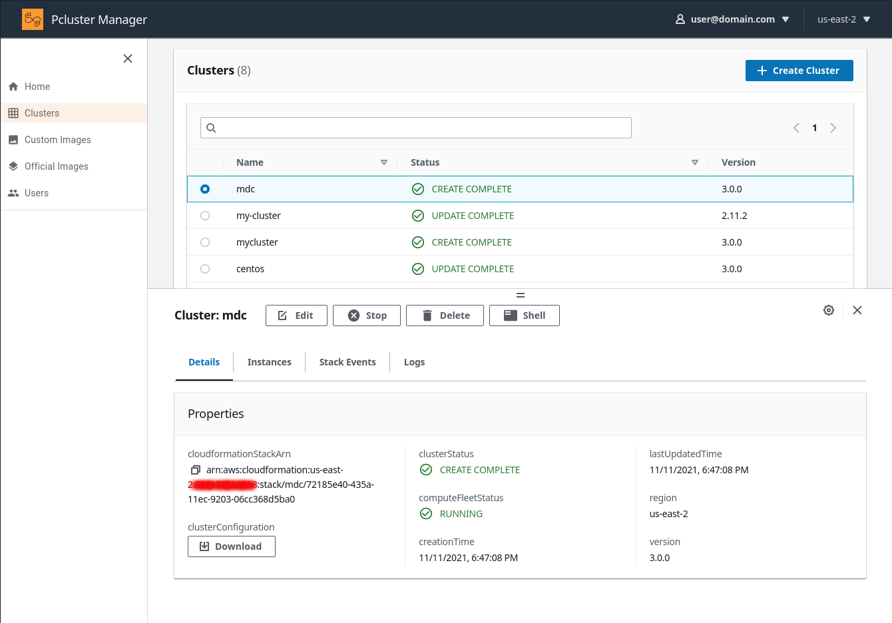

PCluster Manager - Make HPC Easy
================================

## Quickstart (15 mins) 🚀

Launch the stack in your AWS account by clicking on one of the below regions:

| Region       | Launch                                                                                                                                                                                                                                                                                                              | 
|--------------|--------------------------------------------------------------------------------------------------------------------------------------------------------------------------------------------------------------------------------------------------------------------------------------------------------------------|
| North Virginia (us-east-1)   | [](https://us-east-1.console.aws.amazon.com/cloudformation/home?region=us-east-1#/stacks/create/review?stackName=pcluster-manager&templateURL=https://pcluster-manager-us-east-1.s3.amazonaws.com/pcluster-manager.yaml)
| Oregon (us-west-2)    | [](https://us-west-2.console.aws.amazon.com/cloudformation/home?region=us-west-2#/stacks/create/review?stackName=pcluster-manager&templateURL=https://pcluster-manager-us-east-1.s3.amazonaws.com/pcluster-manager.yaml)       |
| Ireland (eu-west-1)    | [](https://eu-west-1.console.aws.amazon.com/cloudformation/home?region=eu-west-1#/stacks/create/review?stackName=pcluster-manager&templateURL=https://pcluster-manager-eu-west-1.s3.amazonaws.com/pcluster-manager.yaml)       |
| Frankfurt (eu-central-1) | [](https://eu-central-1.console.aws.amazon.com/cloudformation/home?region=eu-central-1#/stacks/create/review?stackName=pcluster-manager&templateURL=https://pcluster-manager-eu-central-1.s3.amazonaws.com/pcluster-manager.yaml) |

Enter your email and wait (~15 mins) for the stack to go into **CREATE_COMPLETE**. Using the code from your email login to the Web UI at the address specified in the `Outputs` tab from the cloudformation stack.

For more details see the [Install Instructions](install/README.md).

## Screen Shot



## System Architecture


## Updating

To update the the latest version, run the following, make sure to set the region to where you deployed the stack:

```bash
git clone https://github.com/aws-samples/pcluster-manager.git
cd pcluster-manager/
./scripts/update.sh us-east-1  # should be region where stack is deployed
```

## Local Development

To run Pcluster Manager locally, start by setting the following environment variables:

```bash
export AWS_ACCESS_KEY_ID=[...]
export AWS_SECRET_ACCESS_KEY=[...]
export AWS_DEFAULT_REGION=us-east-2
export API_BASE_URL=https://[API_ID].execute-api.us-east-2.amazonaws.com/prod  # get this from ParallelClusterApi stack outputs
```

Start the API backend by running:

```bash
scripts/run_flask.sh
```

Start the React frontend by running:

```bash
cd frontend/src
npm install # if this is your first time starting the frontend
npm start
```

Then navigate to [http://localhost:3000](http://localhost:3000)

## Security

See [CONTRIBUTING](CONTRIBUTING.md#security-issue-notifications) for more information.

## License

This project is licensed under the Apache-2.0 License.

