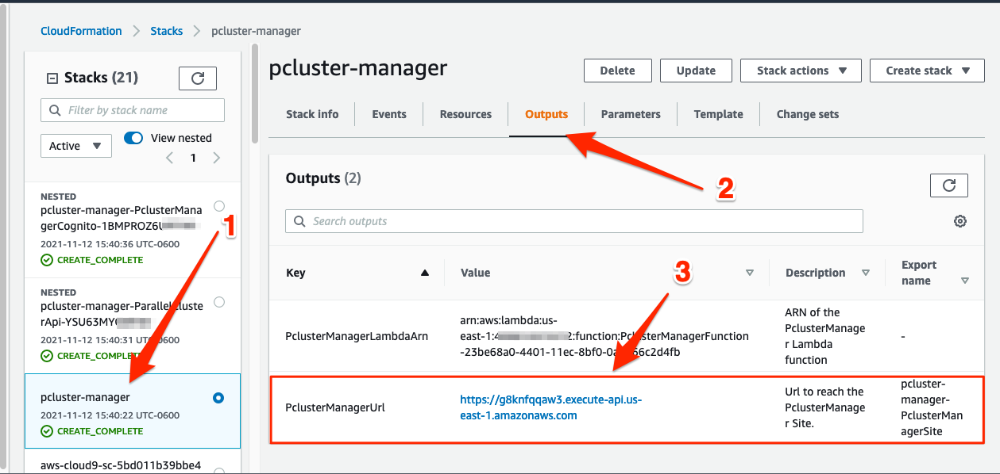
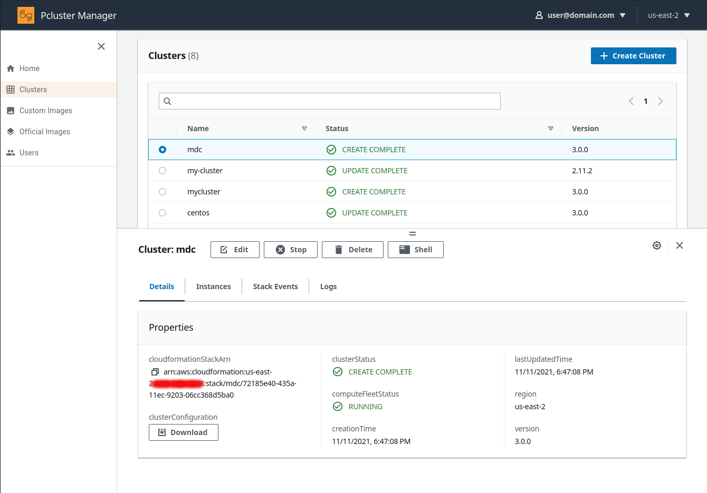
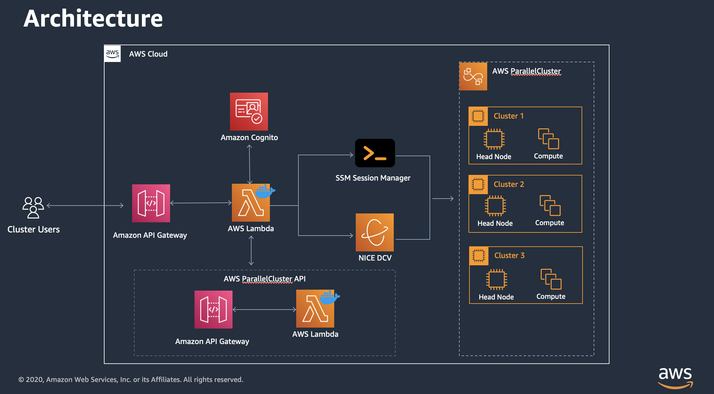

ParallelCluster Manager - Make HPC Easy
================================

This project is a front-end for [AWS Parallel Cluster](https://github.com/aws/aws-parallelcluster)

Quickly and easily create HPC cluster in AWS using ParallelCluster Manager. This UI uses the AWS ParallelCluster 3.0 API to Create, Update and Delete Clusters as well as access, view logs, and build Amazon Machine Images (AMI's).

Want to request a new feature? [open a feature request](https://github.com/aws-samples/pcluster-manager/issues/new)

You can get started with your first cluster in as little as 15 minutes using the links below.

## Quickstart (15 mins) 🚀

Launch the stack in your AWS account by clicking on one of the below regions (use the alternative launch link if S3 template loading fails):

| Region       | Launch                                                                                                                                                                                                                                                                                                              | Alternative launch link |
|--------------|--------------------------------------------------------------------------------------------------------------------------------------------------------------------------------------------------------------------------------------------------------------------------------------------------------------------|--------------------------------------------------------------------------------------------------------------------------------------------------------------------------------------------------------------------------------------------------------------------------------------------------------------------|
| Ohio (us-east-2)  |        |        |
| North Virginia (us-east-1)  |  |  |
| Ireland (eu-west-1)   |        |        |
| Frankfurt (eu-central-1) |  |  |

    
More Regions (Click to expand)

                   
| Region       | Launch                                                                                                                                                                                                                                                                                                              | Alternative launch link |
|--------------|--------------------------------------------------------------------------------------------------------------------------------------------------------------------------------------------------------------------------------------------------------------------------------------------------------------------|--------------------------------------------------------------------------------------------------------------------------------------------------------------------------------------------------------------------------------------------------------------------------------------------------------------------|
| Oregon (us-west-2)    |        |       |
| California (us-west-1)    |        | |
| London (eu-west-2)    |        |  |
| Paris (eu-west-3)    |        |        |
| Stockholm (eu-north-1)    |        |        |
| Middle East (me-south-1) |  |  |
| South America (sa-east-1) |  |   |
| Canada (ca-central-1) |  |  |
| Tokyo (ap-northeast-1) |  |   |
| Seoul (ap-northeast-2) |  |  |
| Mumbai (ap-south-1) |  |  |
| Singapore (ap-southeast-1) |  |  |
| Sydney (ap-southeast-2) |  |   |

Enter your email and wait (~15 mins) for the stack to go into **CREATE_COMPLETE**. Using the code from your email login to the Web UI at the address specified by the `PclusterManagerUrl` in the `Outputs` tab of the main `pcluster-manager` stack.

For more details see the [Getting Started Guide](https://pcluster.cloud).

## Screen Shot

## System Architecture

## Costs

ParallelCluster Manager is built on a serverless architecture and falls into the free tier for most uses. I've detailed the dependency services and their free-tier limits below:

| Service       | Free Tier                                                        |
|---------------|------------------------------------------------------------------|
| Cognito       | 50,000 Monthly Active Users                                      |
| API Gateway   | 1M Rest API Calls                                                |
| Lambda        | 1M free requests / month & 400,000 GB-seconds of compute / month |
| Image Builder | No-Cost except EC2                                               |
| EC2           | ~15 mins one-time to build Container Image                       |

Typical usage will likely cost < $1 / month.

## Reusing a Cognito User Pool

It is possible to reuse a Cognito user pool across multiple PCM instances to avoid having to recreate the user base for each installation. There are two ways to do this:

1. Use an existing PCM installation that utilizes Cognito as a nested stack. This is the default setup when installing PCM through the 1-click links and leaving all Cognito parameters blank.

2. Use a standalone Cognito installation that is deployed before the PCM installation and then linked to it. This has the advantage of being completely separate from PCM and makes CloudFormation updates simpler, as it is not using a nested stack.

### Reusing an Existing PCM Installation with Cognito as a Nested Stack

1. From the CloudFormation console, select the PCM stack that contains the Cognito pool that you want to reuse.
2. Navigate to the Cognito nested stack.
3. Select the **Outputs** tab.
4. Copy the following values:
   - `UserPoolId`
   - `UserPoolAuthDomain`
   - `SNSRole`
5. Install a new PCM instance using the [Quickstart](#quickstart-15-mins-🚀) and fill in all `External PCM Cognito` parameters with the outputs that you just copied. This will prevent PCM from creating a new pool and will use the linked one instead.

### Reusing a Standalone Cognito Installation

1. Launch the Cognito-only stack in the same region as the PCM will be deployed. You can do this by clicking on one of the links below for the desired region (use the alternative launch link if S3 template loading fails).

| Region       | Launch                                                                                                                                                                                                                                                                                                              | Alternative launch link |
|--------------|--------------------------------------------------------------------------------------------------------------------------------------------------------------------------------------------------------------------------------------------------------------------------------------------------------------------|--------------------------------------------------------------------------------------------------------------------------------------------------------------------------------------------------------------------------------------------------------------------------------------------------------------------|
| Ohio (us-east-2)  |        |        |
| North Virginia (us-east-1)  |  |  |
| Ireland (eu-west-1)   |        |        |
| Frankfurt (eu-central-1) |  |  |

    
More Regions (Click to expand)

                   
| Region       | Launch                                                                                                                                                                                                                                                                                                              | Alternative launch link |
|--------------|--------------------------------------------------------------------------------------------------------------------------------------------------------------------------------------------------------------------------------------------------------------------------------------------------------------------|--------------------------------------------------------------------------------------------------------------------------------------------------------------------------------------------------------------------------------------------------------------------------------------------------------------------|
| Oregon (us-west-2)    |        |       |
| California (us-west-1)    |        | |
| London (eu-west-2)    |        |  |
| Paris (eu-west-3)    |        |        |
| Stockholm (eu-north-1)    |        |        |
| Middle East (me-south-1) |  |  |
| South America (sa-east-1) |  |   |
| Canada (ca-central-1) |  |  |
| Tokyo (ap-northeast-1) |  |   |
| Seoul (ap-northeast-2) |  |  |
| Mumbai (ap-south-1) |  |  |
| Singapore (ap-southeast-1) |  |  |
| Sydney (ap-southeast-2) |  |   |

2. After the stack is created, select the **Outputs** tab and copy the following values:
   - `UserPoolId`
   - `UserPoolAuthDomain`
   - `SNSRole`
3. Install a new PCM instance using the [Quickstart](#quickstart-15-mins-🚀) and fill in all `External PCM Cognito` parameters with the outputs that you just copied. This will prevent PCM from creating a new pool and will use the linked one instead.

## Identify the installed version of ParallelCluster and ParallelClsuster Manager
1. From the CloudFormation console, select a PCM stack.
2. Select the **Parameters** tab.
3. The version of ParallelCluster is available under `Version`.
4. The version of ParallelCluster Manager is the latest part of the `PublicEcrImageUri` parameter. For example if the value is `public.ecr.aws/pcm/pcluster-manager-awslambda:3.3.0` the version is `3.3.0`.

## Updating

To update the the latest version, run the following, make sure to set the region to where you deployed the stack:

## Development

See [Development guide](DEVELOPMENT.md) to setup a local environment.

## Security

See [Security Issue Notifications](CONTRIBUTING.md#security-issue-notifications) for more information.

## Contributing

Please refer to our [Contributing Guidelines](CONTRIBUTING.md) before reporting bugs or feature requests

Please refer to our [Project Guidelines](PROJECT_GUIDELINES.md) before diving into the code

## License

This project is licensed under the Apache-2.0 License.

