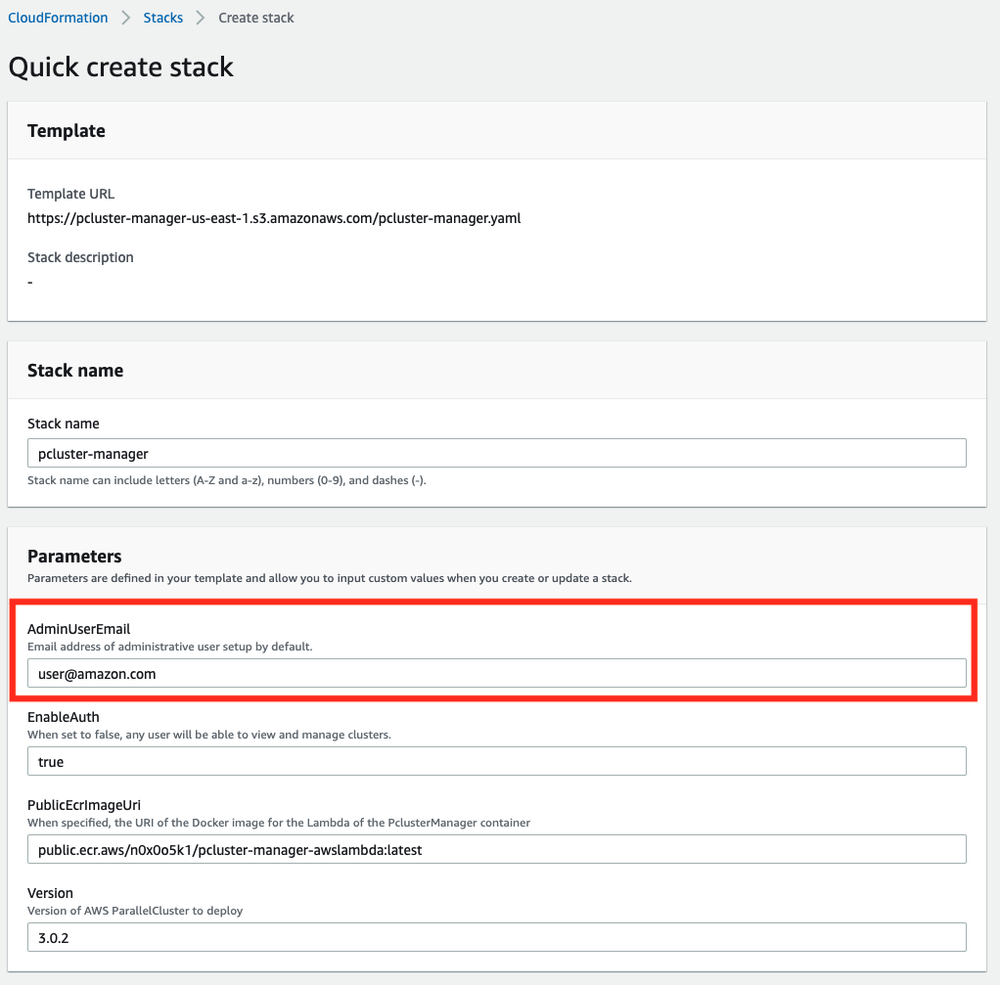

# Installation

### Step 1: CloudFormation Setup
First Deploy the PclusterManager Server (which includes the AWS ParallelCluster API). If you don't see your region below don't fret.

| Region       | Launch                                                                                                                                                                                                                                                                                                              | 
|--------------|--------------------------------------------------------------------------------------------------------------------------------------------------------------------------------------------------------------------------------------------------------------------------------------------------------------------|
| Ohio (us-east-2)   |        |
| North Virginia (us-east-1)   | 
| Ireland (eu-west-1)    |        |
| Frankfurt (eu-central-1) |  |

    
More Regions (Click to expand)

                   
| Region       | Launch                                                                                                                                                                                                                                                                                                              | 
|--------------|--------------------------------------------------------------------------------------------------------------------------------------------------------------------------------------------------------------------------------------------------------------------------------------------------------------------|
| Oregon (us-west-2)    |        |
| California (us-west-1)    |        |
| London (eu-west-2)    |        |
| Paris (eu-north-1)    |        |
| Stockholm (eu-north-1)    |        |
| Middle East (me-south-1) |  |
| South America (sa-east-1) |  |
| Canada (ca-central-1) |  |
| Hong Kong (ap-east-1) |  |
| Tokyo (ap-northeast-1) |  |
| Seoul (ap-northeast-2) |  |
| Mumbai (ap-south-1) |  |
| Singapore (ap-southeast-1) |  |
| Sydney (ap-southeast-2) |  |

### Step 2: Setup CloudFormation Stack

The AWS Console opens on the AWS CloudFormation panel to deploy your stack. Update the field **AdminUserEmail** with a valid email to receive a temporary password in order to connect to the Pcluster Manager GUI. Leave the other fields with their default values and click Next to proceed to Step 3.

Click the two IAM boxes and click **Create Stack**

The setup for Pcluster Manager (and AWS ParallelCluster API) will take approximately 20 minutes.

### Step 3: Login

During the setup process you will receive an automated email with a temporary password which looks like the following (except the email you receive will have a code in the place of the `[REDACTED]` text below. You will use this temporary password to login to your administrator account along with the email you specified in `Step 2` above.

Once the stack has been created (you should see **CREATE_COMPLETE** in green as the status next to the `pcluster-manager` stack) -- go to the `Outputs` tab and select the `PclusterManagerUrl` output to access the site. Use your administrator email from `Step 2` and the temporary password from your email to login to the site.

### Step 4: Create a Cluster

Once you have logged in to the site you will be presented with a page that looks something like the following. Likely if this is your first time interacting with ParallelCluster your list of clusters will be empty. In that case, click the **Create Cluster** in the top right and follow the instructions in the wizard to create your first cluster.

