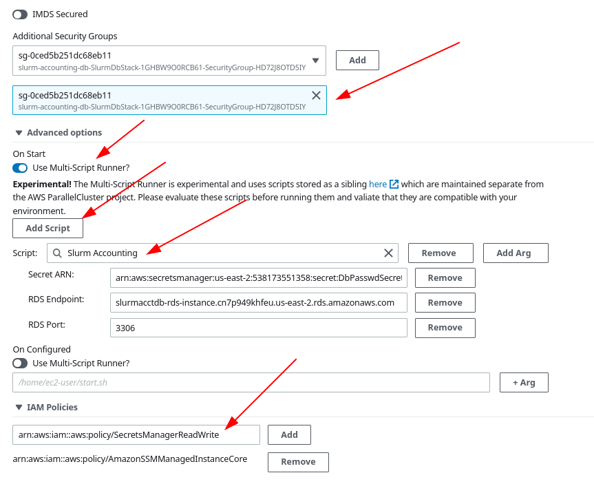

# Slurm Accounting

In this tutorial we will work through setting up Slurm Accounting. This enables many features within slurm, including job resource tracking and providing a necessary building block to slurm federation.

## Step 1 - Setup External Accounting Database

The first requirement is to setup an external database that Slurm can use to store the accounting data.

Use the following CloudFormation Quick-Create link to create the database in
your AWS account. Note that if you would like to create the databas in a
different region, change the value of the `region` parameter in the URL to the
region of your choice and reload the page.

[](https://us-east-1.console.aws.amazon.com/cloudformation/home?region=us-east-1#/stacks/quickcreate?stackName=slurm-accounting&templateURL=https://pcluster-manager-us-east-1.s3.amazonaws.com/slurm-accounting/accounting-cluster-template.yaml)

When you're creating the stack, be sure to specify the `Public subnet AZ` and
`Private subnet AZ` parameters to correspond to the region where you are
creating the stack. All other values should be suitable as defaults, however
feel free to change the database instance type depending on your workload
needs.


## Step 2- Retrieve the outputs from the CloudFormation stack

Once the stack has reached a Completed state. You will need to go to the `Outputs` tab of the stack and make note of the properties as they will be used in the creation of your cluster.


## Step 3 - Add permissions to your lambda

In order to allow our cluster access to secrets we need to add an additional IAM policy.

Go to the Lambda service in the AWS Console and search for `PclusterManagerFunction` (see here, possibly changing the region to meet your needs [Lambda Functions](https://us-east-2.console.aws.amazon.com/lambda/home?region=us-east-2#/functions?f0=true&n0=false&op=and&v0=PclusterManagerFunction) ). Once you find your Function, select it go to `Configuration` > `Permissions` > Click on the role under `Role name`.

Select `Add permissions` > `Attach policy` and choose the `SecretsManagerReadWritePolicy`. You might limit this access to the secret that was created by CloudFormation.


## Step 4 - Create Your Cluster

Next, go to Pcluster Manager and choose the  option to create a new cluster. There are several specific changes you will need to make when creating this cluster.

### Cluster Properties
Choose a suitable name for your cluster, and then in the Cluster Properties window, be sure to choose the VPC that was created by the cloudformation stack. It will have the prefix that you chose and `-vpc` as the name, though you can also reference the `PClusterVpcId` from the CloudFormation Stack Outputs.


### HeadNode Properties

Choose the `-public-subnet` Subnet for your HeadNode:


You will also need to enable the `Virtual Console` option as that allows Pcluster Manager to interact with the cluster directly:


Be sure to enable the Security Group referenced in the CloudFormation outputs so that the HeadNode can access the database.

Next we'll enable a known script that will install slurm accounting on the HeadNode.
- Choose the advanced options
- Under the `On Configured` option, Choose the `Multi-Script Runner` which has some pre-programmed scripts in it
- In the search box choose `Slurm Accounting`
- Fill in the values for the `Secret ARN` and `RDS Endpoint` from the cloudformation output
- Under `IAM Policies` add `arn:aws:iam::aws:policy/SecretsManagerReadWrite` so that the HeadNode can access the password to the database generated by the CloudFormation script. Be sure to actually click `Add` so that it is added to the list.



### Remaining Options

For the remainder of your cluster configuration choose Storage and Queue options that fit the needs of your application. Be sure to choose the `-private-subnet` for your Compute Queues. And finally, `Create` your cluster.


## Step 5 - Submit a job

Once the cluster has been successfully created, go to the `Scheduling` tab and select `Submit Job`


Choose a name for your job, a number of nodes to run under, choose to `Run a command` and provide a simple `sleep 30` command.


## Step 5 - View the Accounting Tab

Once you've submitted a job, you can see the job information under the `Accounting tab`

You can use any of the filters at the top to narrow down the number of jobs in the view to select specific jobs. 


If you choose the Job ID in the left column you can see further detials about the job.


## Sample Config

For anyone looking to create a cluster directly with a config.yaml an example is provided below. Note you will need to replace any `${VARIABLES}` with information from your account. Feel free to customize the remaining cluster configuration to your needs.

```.yaml
HeadNode:
  InstanceType: t2.micro
  Ssh:
    KeyName: ${KEY_PAIR}
  Networking:
    SubnetId: ${PRIVATE_SUBNET}
    AdditionalSecurityGroups:
      - ${SECURITY_GROUP}
  Iam:
    AdditionalIamPolicies:
      - Policy: arn:aws:iam::aws:policy/AmazonSSMManagedInstanceCore
      - Policy: arn:aws:iam::aws:policy/SecretsManagerReadWrite
  CustomActions:
    OnNodeConfigured:
      Script: >-
        https://raw.githubusercontent.com/aws-samples/pcluster-manager/post-install-scripts/resources/scripts/multi-runner.py
      Args:
        - >-
          https://raw.githubusercontent.com/aws-samples/pcluster-manager/post-install-scripts/resources/scripts/slurm-accounting.sh
        - >-
          -${SECRET_ARN}
        - '-${RDS_ENDPOINT}'
        - '-3306'
Scheduling:
  Scheduler: slurm
  SlurmQueues:
    - Name: queue0
      ComputeResources:
        - Name: queue0-t2-micro
          MinCount: 0
          MaxCount: 4
          InstanceType: t2.micro
      Networking:
        SubnetIds:
          - ${PRIVATE_SUBNET_ID}
Region: us-east-2
Image:
  Os: alinux2
```
